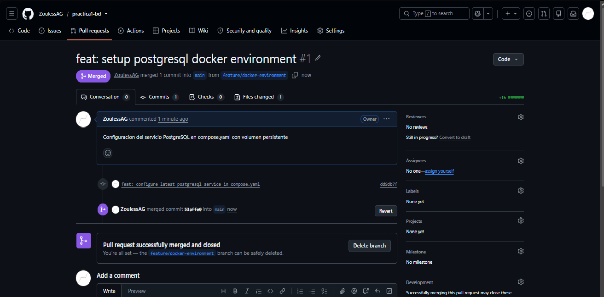
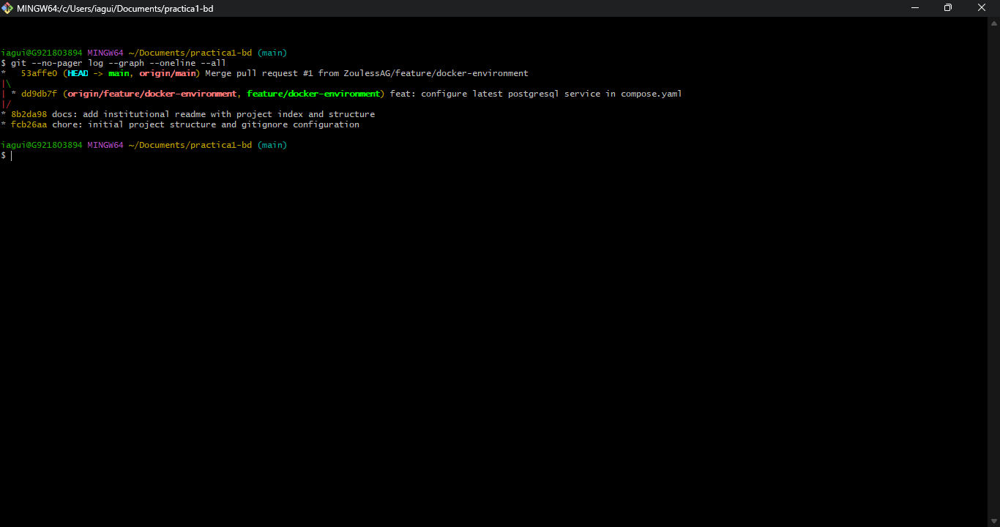
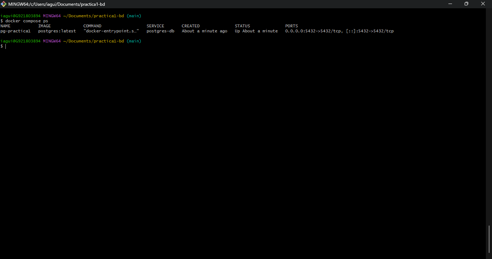
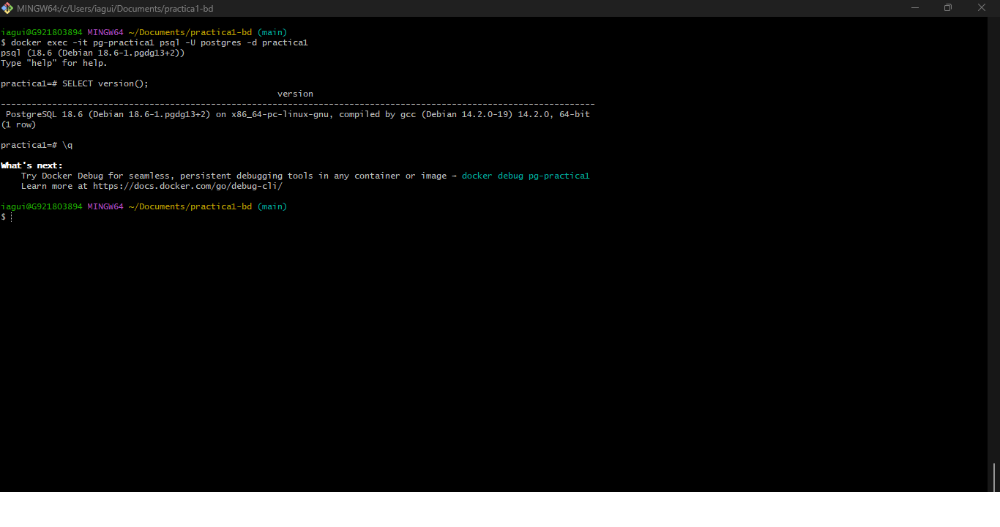

# Instituto Politécnico Nacional
## Escuela Superior de Cómputo

**Unidad de Aprendizaje:** Bases de Datos  
**Plan de Estudios:** Ingeniería en Sistemas Computacionales (2020)  
**Práctica 1:** Modelo Entidad Relación

**Alumno:** Aguilar Garcia Ian Andrew  
**Boleta:** 2026630300  
**Grupo:** 3CV2

---

### Índice de Entregables
1. [Investigación Teórica: Unidad I](docs/investigacion-bases-de-datos.pdf)
2. [Estado del Arte: Artículos Científicos](docs/estado-del-arte.pdf)
3. [Caso de Estudio y Modelo ER](docs/caso-de-estudio.pdf)
4. [Diagrama Entidad-Relación](modelo/diagrama-er.png)
5. [Configuración Docker Compose](compose.yaml)
6. [Evidencias de Git y Docker](evidencias/)

### Instrucciones de Despliegue
Para levantar el gestor de base de datos en un contenedor local:
```bash
docker compose up -d
```
Para verificar el estado del contenedor en ejecución:
```bash
docker compose ps
```

Para acceder a la consola interactiva de PostgreSQL y validar el motor:
```bash
docker exec -it pg-practica1 psql -U postgres -d practica1
```

---

<a id="evidencias-de-git-y-docker"></a>
## 6. Evidencias de Git y Docker

### Control de Versiones (Git & GitHub)

* **Fusión de Pull Request en la rama principal (`main`):**  
  

* **Historial y Árbol de Ramas (`git log --graph`):**  
  

### Despliegue del Entorno de Base de Datos (Docker)

* **Contenedor PostgreSQL Activo (`docker compose ps`):**  
  

* **Verificación de Conexión Interactiva (`psql`):**  
  